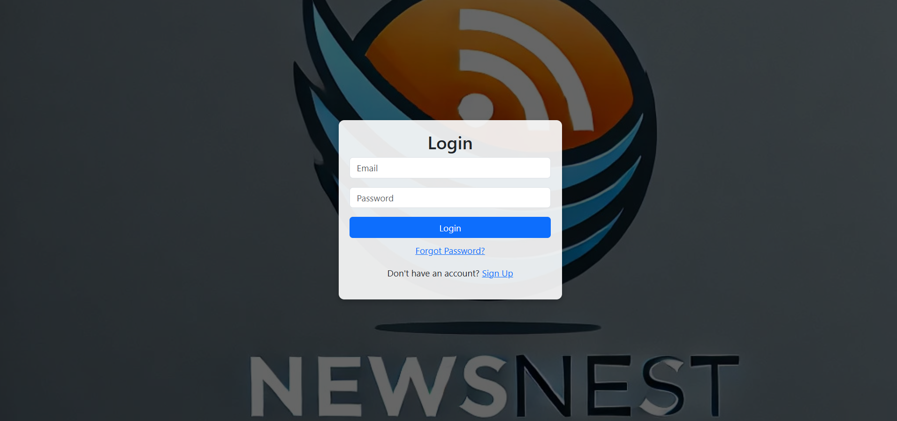
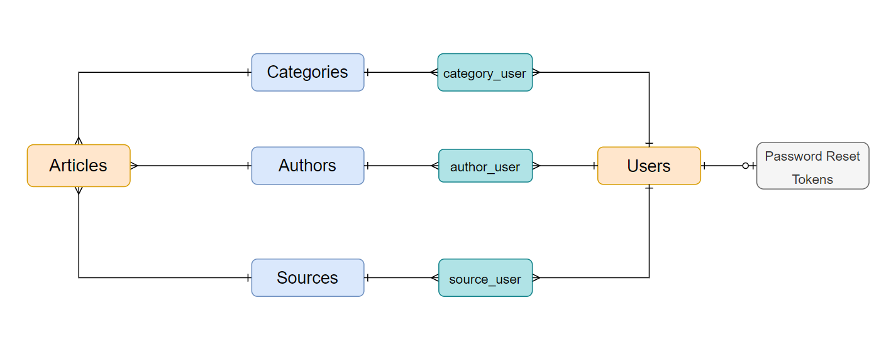

# News Nest - Laravel App



## To run this project

### Method 1

- Clone the project using this command. 

```
git clone https://github.com/EngAbdelrahmanMagdi/Laravel-News-Nest.git
```


- Copy .env.example content inside .env file with your own credentials for the keys.
```
cp .env.example .env
```    

- Start Application using Docker by this command.
```
docker compose up -d --build
```

#

### Method 2 

- Clone the project using this command. 

```
git clone https://github.com/EngAbdelrahmanMagdi/Laravel-News-Nest.git
```

- Copy .env.example content inside .env file with your own values.
```
cp .env.example .env
```  

- Install dependencies using these commands. 

```
composer install
```
```
npm install
```

- Create PostgreSQL database with your own values in .env .
- Run Database Migrations. 

```
php artisan migrate
```
- Run Cron Job to fetch articles. 

```
php artisan news:fetch
```
- Configure the mail settings in the .env file to enable password reset emails.

- Start the Server using this command. 

```
php artisan serve
```


## Description

- NewsNest is a full-featured news aggregation platform that allows users to:

- Register, log in, and reset passwords.

- Browse and search for articles.

- Filter news by authors, categories, sources, and dates.

- Update their personalized news preferences.


## Features

- User Authentication: Register, login, and reset password.

- News Feed: Browse and read articles from multiple sources.

- Advanced Filtering: Filter articles by authors, categories, sources, and date.

- Personalized Experience: Update news preferences for a customized feed.

- Mobile Responsive: Optimized for all screen sizes.

## Relationships 

- Users have many Categories, Sources, and Authors through pivot tables (category_user, source_user, author_user).
  
- Users have password reset tokens (password_reset_tokens) linked via email.

- Authors, Categories, and Sources have many Articles.
  
- Articles reference Authors, Categories, and Sources using foreign keys.
  
  


<h4>Made by / Abdelrahman Magdy</h4>